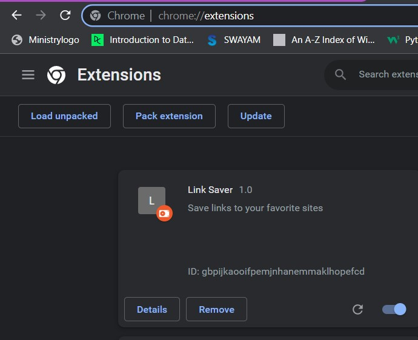

# ABOUT
To use : download the repository 
and load unpacked in chrome browser

#USAGE
SAVE TAB : to save the url in input to list
DELETE ALL : to delete the local storage of saved url's
ADD INPUT : to save the currently active chrome tab

